<div align = "center" class="container">
<div class="starter-template">
  <h1>Pi WALL-E</h1>
    <h3> A cute Self-Balanced Robot</h3>
  <p class="lead"> Yucheng Peng (yp284) | Yuchen Lu (yl2237)</p>
</div>
        <hr>
        <div style="text-align:center;">
            
            <h4>This is how Pi WALL-E looks like</h4>
        </div>
  <hr>
  <div class="center-block">
      <iframe width="640" height="360" src="https://www.youtube.com/embed/dQw4w9WgXcQ" frameborder="0" allowfullscreen></iframe>
      <h4 style="text-align:center;">Demonstration Video</h4>
  </div>


## INTRODUTION

Hi! Before introduction, let us introduce our little boy first! This is our Pi WALL-E robot! This robot is a self-balanced car, and it only has two wheels! Its eye consists of a ginbal with a camera and an Android app connected to our phone. We could see the world through WALL-E’s eye!

## MOTIVATION AND INTRODUCTION 

In 5725 lab3, our team finish a four-wheel car and control the car to move forward and backward and, we change the speed of the car to move faster and slower. Then an intriguing notion that comes to our mind is to make a two-wheel car to balance itself! Thus, in this final project, we choose to implement our self-balanced car ‘WALL-E’. 

The reason why the robot gets its name ‘WALL-E’ is that we set a gimbal with a camera on the top of this car. Its looks just like the ‘WALL-E’ robot. We set an Android app connected to the phone to control the gimbal and rotate the camera, thus we can see the world in different directions from WALL-E’s eye. The Robot WALL-E’s method of balancing and moving stably by reading the moving acceleration to compute corresponding angles. The change of angle will decide the motor speed like when the robot is moving forward, and the angle change will increase the forward speed to balance WALL-E. More details, principles, and results of WALL-E to control its self-balance and see all directions of the world will be illustrated in the following sections. Now, let's go!

## FIRST YOU NEED TO KNOW

**Components Need:** 

- Raspberry Pi *1
- MPU6050 *1
- 12V motors with encoder *2
- TB6612 *1 (Suggestion: Prepare more than 1, it is easily to burn )*
- Pi Camera  * 1
- Gimbal (2 Servos that help Camera to move ) *1
- Bread board and some pin-hole wires

The balanced robot is a really complicated system and you need much time and patience! Good Luck

By the way, feel **Free** to contact us! Our email are yp284@cornell.edu and yl2237@cornell.edu. 

## HOW TO START 

We will display the code step by step to show how it works.

You need to connect the Raspberry Pi to all the components like the picture shown below.

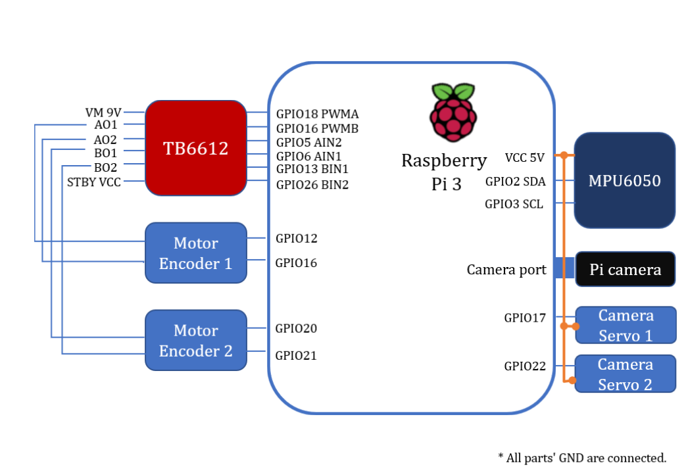

### Raspberry Pi code

This is our Self-Balanced Robot core control program.  We write two version of control program in **C** and **Python**.

The C code works successfully to balanced robot so I will follow the C code to tell you how to start.

We didn't success with the python code but we also put our python code on the GitHub. Maybe you can improve it!

#### C code

##### Step 1: Install **bcm2835**  and **libi2c-dev**

We provide a bcm2835 library in the Library folder and you can also download it from official website

```shell
#Make Sure You are now in ../bcm2835-1.64
./configure
make
sudo make check
sudo make install
```

libi2c-dev is default installed on your Linux kernel.

##### Step2: Load **encoder** module

We suppose you are familiar with Linux module programing.

```shell
#Make Sure You apt is the latest
sudo apt-get upgrade
#Then install the headrs
sudo apt-get install raspberrypi-kernel-headers
```

With the kernel updated, the header will also changed. You can check your headers in the /usr/src/linux-headers-x.xx.xx and then modify the Makefile file to your kernel version.

```shell
#Make sure you are now in ../Libary/encoder_driver

obj-m += encoder.o
KERNEL :=/usr/src/linux-headers-4.19.66-v7+/
all:
		make -C $(KERNEL) M=$(shell pwd) modules
clean:
		make -C $(KERNEL) M=$(shell pwd) clean

#Change the KERNEL :=/usr/src/linux-headers-4.19.66-v7+/ to your KERNEL :=/usr/src/linux-headers-x.xx.xxxx/
```

Once you set, use the command to compile the **encoder** module

```shell
sudo make clean
sudo make all
sudo make
```

After compiling, we need to load our module by the following command.

```shell
sudo insmod encoder.ko
```

And we can use the command to make sure the encoder module is successfully loaded 

```shell
sudo ismod
```

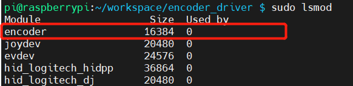

##### Step3: Compile C Program

Now, all the pre-requirement are set! Now we can run the control program.

```shell
#Make sure you are now in ../C/CODE
sudo make clean
sudo make all
sudo make
sudo ./main
```

##### Step4: Start Pi camera 

You can see the link below to know how to start pi camera.

```shell
#Make sure you are now in ../Raspberry Pi Code/Python/pi-camera-stream-flask
python3 main.py
```

##### Step5: Start RPi as TCP server 

```shell
#Make sure you are now in ../Raspberry Pi Code/Python/RPi program
python3 TCP_control_servo.py
```

##### Step5: Start Android APP

```shell
#Make sure you are now in ../Raspberry Pi Code/Python/RPi Rrogram
python3 TCP_control_servo.py
```

Just click run button in Android Studio.

## Pi WALL-E DETAILS AND THEORIES

### WALL-E's Eye

The WALL-E's eye is composed by Gimbal, Pi camera and android phone.

#### Pi camera


The Camera Module 2 can be used to take high-definition video, as well as stills photographs.

#### Android APP

This Android can simply seen as two parts.

 One part is read video data from the Pi Camera.

```java
        //----------------------------------------------------
        // WebView Init
        //----------------------------------------------------
        webView = (WebView) findViewById(R.id.webView);
        webView.loadUrl("http://172.20.10.9:5000");        //webView.loadUrl("http://www.google.com");
        // make the webview adapt to the screen
        WebSettings settings = webView.getSettings();
        settings.setUseWideViewPort(true);
        settings.setLoadWithOverviewMode(true);
        webView.setWebViewClient(new WebViewClient());
        webView.getSettings().setJavaScriptEnabled(true);
        webView.getSettings().setDomStorageEnabled(true);
        webView.setOverScrollMode(WebView.OVER_SCROLL_NEVER);
```

Android app start a thread and then set up a socket connection with RPi. 

```java
class ClientThread implements Runnable {
    private String msg;
    Socket s;
    PrintWriter pw;
    String type;
    BufferedReader bufferedReader;

    ClientThread(String msg) {
        this.msg = msg;
    }

    public void run() {
        try {
            s = new Socket("172.20.10.9", 7654);
            pw = new PrintWriter(s.getOutputStream());
            pw.write(msg);
            pw.flush();
            bufferedReader = new BufferedReader(new InputStreamReader(s.getInputStream()));
            String msg2 = bufferedReader.readLine();


            bufferedReader.close();
            pw.close();
            s.close();
        } catch (UnknownHostException e) {
            System.out.println("Fail");

            e.printStackTrace();
        } catch (IOException e) {
            System.out.println("Fail");
            e.printStackTrace();
        }
    }
}
```

Like the following command, after connected, socket will send the string to RPi server. 

```java
new Thread(new ClientThread("Move1")).start();
```

### WALL-E's Body

WALL-E's body is composed by MPU6050, TB6612, 12V Motors with encoders, and breadboard. Here is the code structure of WALL-E's body

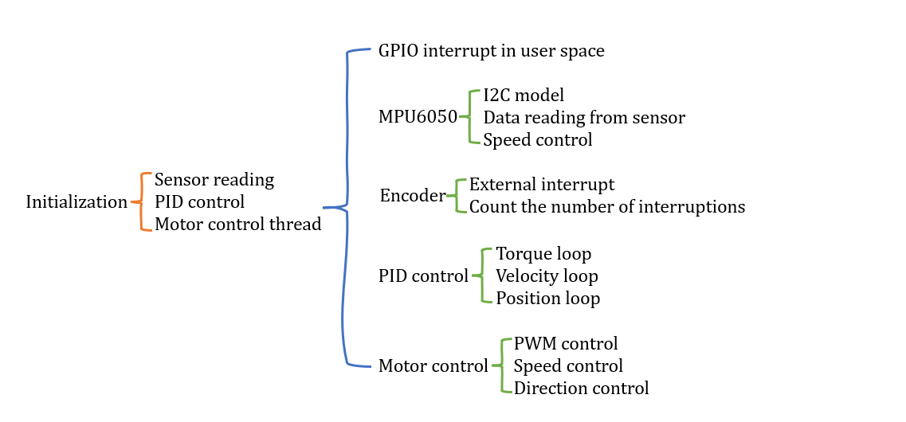

#### TB6612

TB6612 will set as logical high and logical low and control the direction of left motor. As shown in the table:

| GPIO    | Output     | Control                        |
| ------- | ---------- | ------------------------------ |
| 5,  6   | HIGH,  LOW | Left  Motor Clockwise          |
| 5,  6   | LOW,  HIGH | Left  Motor Counter-Clockwise  |
| 13,  26 | HIGH,  LOW | Right  Motor Clockwise         |
| 13,  26 | LOW,  HIGH | Right  Motor Counter-Clockwise |

Different input to TB6612 can control different direction of motors.

#### MPU6050

In this section, the key sensor MPU6050 will be illustrated Fig. 1. To keep our two-wheel balanced car ‘WALL-E’ upright and moving forward and backward smoothly, the first thing that needs to obtain is the attitude angle of the car and the change of angle will decide the motor speed. Sensor MPU6050 is a three-direction sensor used to read all acceleration of x, y, and z directions to compute the corresponding moving angle of x, y, and z directions. This computing method will be explained later. Through the angle, the attitude of the car relative to the ground will be obtained to make corresponding control adjustments. For example, when the robot is moving forward, the angle will be computed, and the forward speed will be increased to balance the car. 

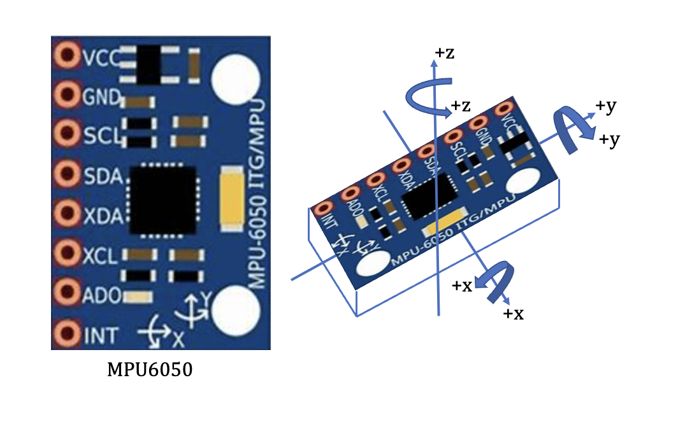

The angle computing method in this section is the Quaternion method [1]. DMP library is provided in MPU6050. The quaternion method is used in the underlying algorithm and the driver is configured and transplanted to use quaternion to moving angles. Besides, commonly used attitude computation methods also include the Kalman filter and complementary filter methods [2]. In the configure and transplant work of MPU6050, the following work is illustrated in Fig. 2 in inv_mpu.c file

```c
/* The following functions must be defined for Pi WALL-E:
 * i2c_write(unsigned char slave_addr, unsigned char reg_addr,
 *      unsigned char length, unsigned char const *data)
 * i2c_read(unsigned char slave_addr, unsigned char reg_addr,
 *      unsigned char length, unsigned char *data)
 * delay_ms(unsigned long num_ms)
 * get_ms(unsigned long *count)
 */
```

These functions of i2c_write, i2c_read, delay_ms, get_ms, reg_int_cb, labs, fabsf, and min functions need to be defined and implemented, and other functions in the DMP library are these interfaces called. Functions of get_ms and reg_int_cb are the timestamp and callback functions, respectively. ‘labs’ is a function of the Linux standard library (stdlib. h); ‘fabsf’ and ‘fabs’ are available in the math library (math. h). The parameter of ‘fabsf’ is float and the parameter of ‘fabs’ is a double float, thus in this program, ‘fabsf’ is used with the float parameters.

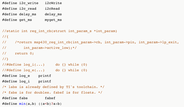

Then functions of i2cwrite, i2cRead, and delay_ms are implemented by the following codes. 

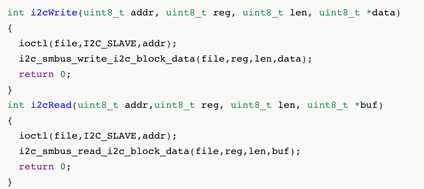

The parameter list of the read-write function and function prototype is determined. Therefore, the function prototype could not be defined casually to avoid error prompting during compilation. The parameter list consists of the slave address, register, data length, and data content. The address uses 7-bit address mode. I2c and SMBus are used in this code. I2C is a two-wire communication protocol developed by Philips, which is often used in small devices that don’t require high speed. SMBus is a system management bus based on the I2C protocol. I2c and SMBus are compatible in the system generally. Firstly, the ioctl function is used to set the slave address, and then call the i2c read and write functions to read and write data. The delay millisecond function is implemented using the usleep function which is a subtle function and multiplied by 1000 to achieve millisecond delay.

After completing the i2c read-write function and delay function, the data of mpu6050 will be read next. The first thing to realize is to read the ID of mpu6050 to ensure normal communication; then configure mpu6050, set clock, acceleration, and gyroscope range, etc. Then invoke the api of the DMP library to initialize MPU and DMP and read the DMPU data to calculate the angle to control the speed of the car in code below

```c
void MPU6050_init(void) {
    MPU6050_setClockSource(MPU6050_CLOCK_PLL_YGYRO); //Clock
    MPU6050_setFullScaleGyroRange(MPU6050_GYRO_FS_2000);//Servo range setting
    MPU6050_setFullScaleAccelRange(MPU6050_ACCEL_FS_2); //加Acceleration maximum range +-2G
    MPU6050_setSleepEnabled(0); //Enter working state
    MPU6050_setI2CMasterModeEnabled(0);     //Avoid MPU6050 controlling AUXI2C
    MPU6050_setI2CBypassEnabled(0);     //Close connection between I2C of the main controler and AUXI2C of MP6050
	DMP_Init();
}
```

Then the roll and pitch angles will be computed by the following code. Then the roll and pitch angles will be computed to control the motor speed in the next section.

```C
void Read_DMP(void)
{   
      unsigned long sensor_timestamp;
        unsigned char more;
        long quat[4];

                dmp_read_fifo(gyro, accel, quat, &sensor_timestamp, &sensors, &more);       
                if (sensors & INV_WXYZ_QUAT )
                {    
                     q0=quat[0] / q30;
                     q1=quat[1] / q30;
                     q2=quat[2] / q30;
                     q3=quat[3] / q30;
                     Pitch = asin(-2 * q1 * q3 + 2 * q0* q2)* 57.3;     
                     Roll = atan2(2 * q2 * q3 + 2 * q0 * q1, -2 * q1 * q1 - 2 * q2* q2 + 1)* 57.3; // roll
                }

}
```

#### Encoder

How to get the correct speed of our cute ‘WALL-E’ robot? The position angle of the balance car only relying on the feedback of the MPU6050 sensor could not maintain a static balance. It must be combined with the speed feedback of the motor to achieve a stable self-balance. Generally, there are two methods to measure motor speed, one is the Hall encoder, and the other is the photoelectric encoder. The accuracy of the photoelectric encoder is higher than the Hall encoder with a higher price. Therefore, in our project, we use the Hall encoder for our WALL-E robot (Fig. 8).

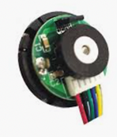

There are two motors to control the speed and each motor has a hall encoder then are connected to RPI gpio12, gpio16, gpio20, and gpio21. 

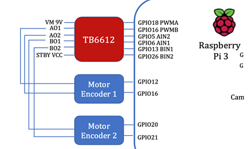

The encoder has two phases: A phase and B phase. They are exactly 90 degrees out of phase in the output of the waveform and this phase difference is used to judge the motor's forward and reverse rotation. As shown in picture below.

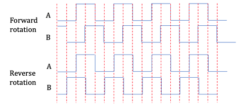

There are two-phase waveform diagrams of the motor forward and reverse rotation. In the case of motor forward rotation, when phase A runs ahead of phase B, B signal is always low at the rising edge of A, A is always high at the rising edge of B, B is high at the falling edge of A, and A is low at the falling edge of B. In the case of motor reverse rotation, A signal is always low at the rising edge of B, B is always high at the rising edge of A, A is high at the falling edge of B, and B is low at the falling edge of A.

Besides, four-time frequency speed measurement is implemented by cooperation and computation of A, B phase signals. That is, several times are counted at each rising and falling edge so that there can be 4 counts in one cycle to improve the accuracy and rate of speed measurement. To improve the timeliness of response, GPIO interrupts are used to capture the signals of the encoders. The interrupt of the Linux system is managed by the kernel and could not be used at the application layer. Therefore, it is necessary to implement the program in the kernel. This is equivalent to the driver of the encoder, and it is quite suitable with the kernel module. As shown this picture,

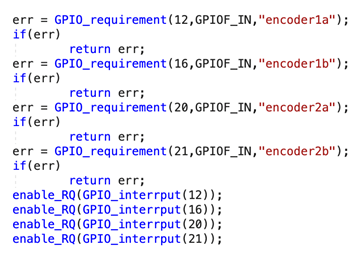

In the init function, mode requirement and configuration are set to use GPIO. Function GPIO_requirement () with three parameters of GPIO number, mode, and the name. Function enable_RQ is used to enable the interrupt and its parameter is the interrupt number. The interrupt number corresponding to GPIO is obtained by function GPIO_interrput (). As shown in pciture

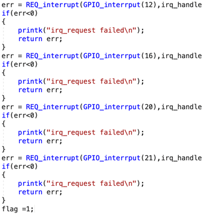

 the function REQ_interrupt is used to configure the interrupt callback function, trigger mode, name, and input parameters. The interrupt function of Linux is divided into two parts: the top half and the bottom half. The top half is the real callback function. The execution is in the interrupt context and generally could not be interrupted to execute the part that must be done. The bottom half is triggered by the top half, and other less urgent matters that interrupt callbacks are executed. The programs in the bottom half will participate in the kernel scheduling and could be interrupted.

In our RPI, 4-time frequency speed measurement is used and if the rotation is forward, the count of the encoder will be increased by 1, and if the rotation is reversed, the count of the encoder will be decreased by 1, as shown in pciture

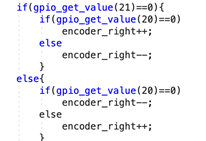

Because the count of the encoder is proportional to the motor speed, it is no need to compute the specific speed of the motor. Therefore, the count values are directly used as the speed feedback of the PID controller as the following code.

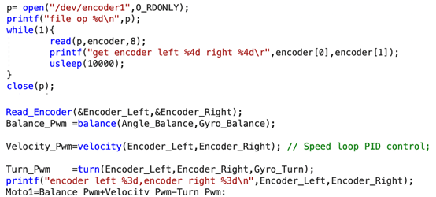

## TESTS AND RESULTS 

### Android APP

The GUI of the Android app is shown in Figure. The buttons in the lower right corner are used to control the rotation direction of the camera. There is a TCP server in RPI and when the direction button is pressed, a thread will be started in APP via socket API to send commands to RPI. For example, when the ‘L’ left button is touched, our control app will start a thread and send the ‘turn left’ command to RPI via socket API. Then the ginbal will control the camera to turn left and WALL’E could see the left things he wants to know!

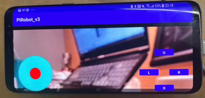

### WALL-E’s balance

 As shown in codes in the last sections and figures, firstly the robot could keep balanced before running the ‘main.c’ code. After running balanced code, the robot could keep upright. When we push it forward, it will read the forward angle and increase its forward speed to keep balance. 

As shown in the left column of the figure below, m1 and m2 are the speed of the left and right motors respectively and gyro is an acceleration coefficient. When the angle increases from 1.96 degrees to 2.52 degrees, the gyro will increase from 30 to 52 and the motor speed will increase from 422 to 472 to avoid robot ‘WALL-E’ falling. As shown in the right column of the figure below, the measured angle of the robot is 6 degrees, so it has an initial motor speed of 247 to avoid falling. With the decreasing of the angle from 6.13 degrees to 5.95 degrees, the speed of motors is decreased from 248 to 229.

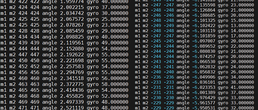

To avoid the speed increasing extremely fast and burning out the servo, a safe system is set in the motor control file. As shown in the figure below, when the robot ‘WALL-E’ is falling so fast and the angle increased dramatically, the motor speed will be increased extremely fast to reach the max value of speed and angle. Then the motor will stop immediately and let the robot ‘WALL-E’ rest for a while. For example, when the angle is 40 degrees and the speed is 2000, this robot will shut down safely and get a rest and stop working.

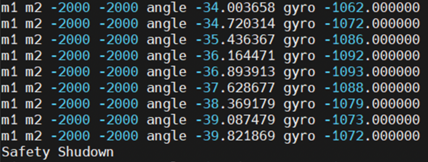

### Performance of Program  

As the result shown below, this program reads **57 times/second** of angel. Then set PWM signal to TB6612 **29 times/second**. It is really fast than python code so we successfully to let the  Pi WALL-E self balanced. 

```shell
pi@raspberrypi:~/workspace/pi-robot/Robot Code $ sudo ./main
b=2
b=18
b=0
mpu_set_sensor complete ......
mpu_set_sensor complete ......
mpu_configure_fifo complete ......
mpu_set_sample_rate complete ......
dmp_load_motion_driver_firmware complete ......
dmp_set_orientation complete ......
dmp_enable_feature complete ......
dmp_set_fifo_rate complete ......
mpu_set_dmp_state complete ......
Angle Time: 1639886607
Angle Time: 1639886607
Set PWM time:1639886607  Angle Time: 1639886607
Angle Time: 1639886607
Set PWM time:1639886607  Angle Time: 1639886607
Angle Time: 1639886607
Set PWM time:1639886607  Angle Time: 1639886607
Angle Time: 1639886607
Set PWM time:1639886607  Angle Time: 1639886607
Angle Time: 1639886607
Set PWM time:1639886607  Angle Time: 1639886607
Angle Time: 1639886607
...
```

### Last word

As shown in the video, we design a two wheel self-balanced robot and add an cute eye on the top of the robot. Then name this cute robot as Pi WALL-E. We set an Android app connected to the phone to control the gimbal and rotate the camera, thus we can see the world in different directions from WALL-E’s eye.

Pi WALL-E only has two wheels but it can self balanced very well! We can also see the video on the phone from the Pi WALL-E's eye and control the eye move around.

<hr>
<div class="row" style="text-align:center;">
      <h2>Work Distribution</h2>
      <div style="text-align:center;">
          
          <h4>Joe, Us, and Pi WALL-E!</h4>
      </div>
      <div class="col-md-6" style="font-size:16px">
          
          <h3>Yucheng Peng</h3>
          <p class="lead">yp284@cornell.edu</p>
          <p> Design the Balancing, Android, and RPi CODEs. <br>
              Complete final html file.
      </div
      <div class="col-md-6" style="font-size:16px">
          
          <h3>Yuchen Lu</h3>
          <p class="lead">yl2237@cornell.edu</p>
          <p> Assemble the Pi WALL-E and debug the CODEs. <br>
              Write and complete final report.
      </div>
  </div>


<hr>
  <div style="font-size:18px">
      <h2>Parts List</h2>
      <ul>
          <li>Raspberry Pi $35.00</li>
          <li>Raspberry Pi Camera V2 $25.00</li>
          <li>MPU6050 $3</li>
          <li>TB6612 $0</li>
          <li>Gimbal $0</li>
          <li>12V Motors with encoder $13</li>
          <li>Structure $60</li>
      </ul>
      <h3>Total: $101</h3>
  </div>
  <hr>
  <div style="font-size:18px">
      <h2>References</h2>
      <a href="https://picamera.readthedocs.io/">PiCamera Document</a><br>
      <a href="http://abyz.co.uk/rpi/pigpio/">Pigpio Library</a><br>
      <a href="https://sourceforge.net/p/raspberry-gpio-python/wiki/Home/">R-Pi GPIO Document</a><br>
      <a href="https://www.bilibili.com/read/cv6843150/?from=readlist">Pi Robot</a><hr>

  <div class="row">
          <h2>Code Appendix</h2>
  </div>
We put all our CODEs in the github! See the linke below.

https://github.com/Typo90/ECE5725-Self-Balanced-Robot

<hr>
<div >
    <h2>Thanks</h2>
    <p >
        Here, we sincerely appreciate all of you that provides help in the success of Pi WALL-E.<br />
        First and foremost, thank Professor Joe Skovire. You provdie a platform for us to bulid this cute Pi WALL-E robot.
        And we also really appreciate your suggestions like version control and how to make python code faster. <br />
        Thank all TAs that help us to dubug and to find some components from lab.<br />
        Thank Guirong Lin that shipped the 12V motors and whole structure of the Pi WALL-E from China <br />
        Thank Yuchong Geng's 32g SDcard. And thank you for spending a whole night debugging with us.<br />
        Thank Hehong Li's android phone that helped us get through the hard time during the loss of our phone.<br />
        Thank Haowen Jiang and Ruidi Peng's Raspberry Pi and Pi camera.<br />
        Thank Jiao Yang's motors and TB6612.<br />
        Thank Kuan Lu's access of maker lab and encouragement for us.<br />
		Thank Hanzhong Liang's help to PID paremters adjustment.<br/>

